# KD240 PWM LED
+ This article mainly explains how to implement a breathing light effect on the KD240

**Last update: 2024/03/07**
- [x] **Achieve with Vivado & Vitis Design Flow**
- [x] **Achieve with PYNQ Design Flow**

## Vivado
## Custom PWM IP
+ Vivado has the option to create and package IP under the Tools menu in the top bar. The following section will demonstrate how to add a PWM IP to the IP Catalog for future use
1. Select Create and Package New IP in Vivado
​

2. Proceed with the default settings by clicking Next


3. Set up the PWM IP, which will open a temporary project to configure the IP
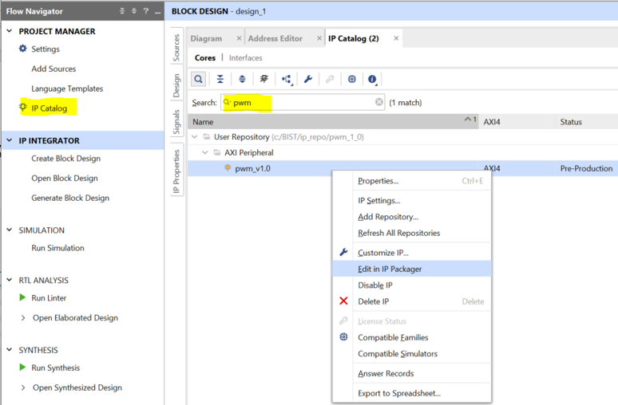

4. Add the PWM RTL code, Source Code - ax_pwm.v
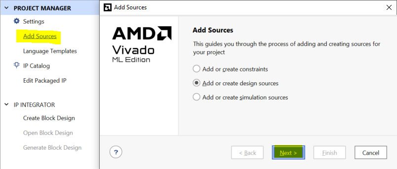


5. Modify the AXI Top RTL code to incorporate the PWM RTL code
+ pwm_v1_0_S00_AXI.v


+ pwm_v1_0.v


+ Ensure that the AXI Reset is set to 0 as the initial register value, consistent with the PWM Code


6. Merge Changes and Re-Package IP


## Create Block Design - Start by importing IP into the Block Diagram in Vivado using the GUI
1. Call ZYNQ IP


2. Call PWM IP


3. Define the PWM IP output ports as external interfaces
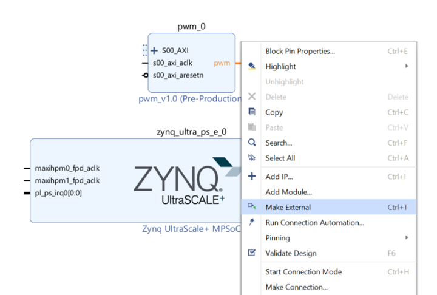

4. Automatically connect the IP via the AXI Bus using Vivado's Connection Automation


5. Validate the design to ensure there are no issues
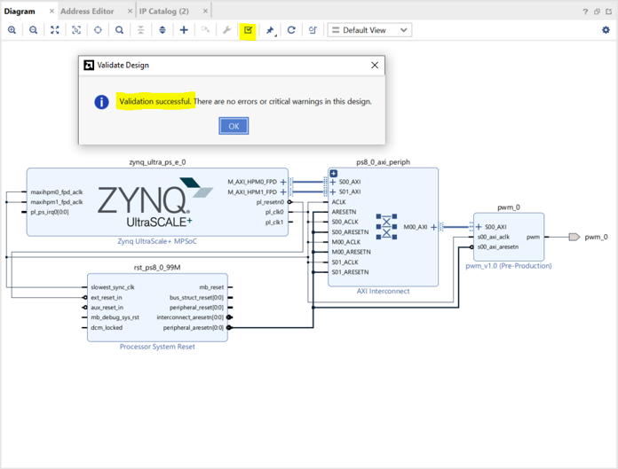

6. Add XDC content
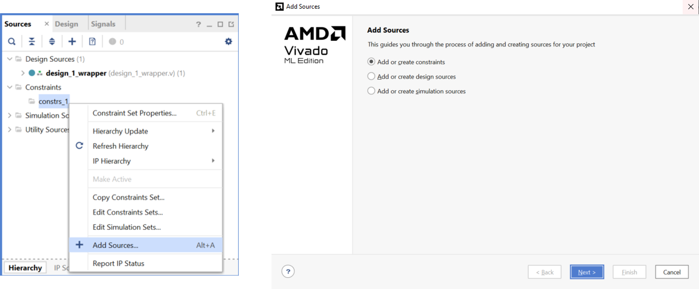


XDC content can be cross-referenced with the KD240 circuit diagram

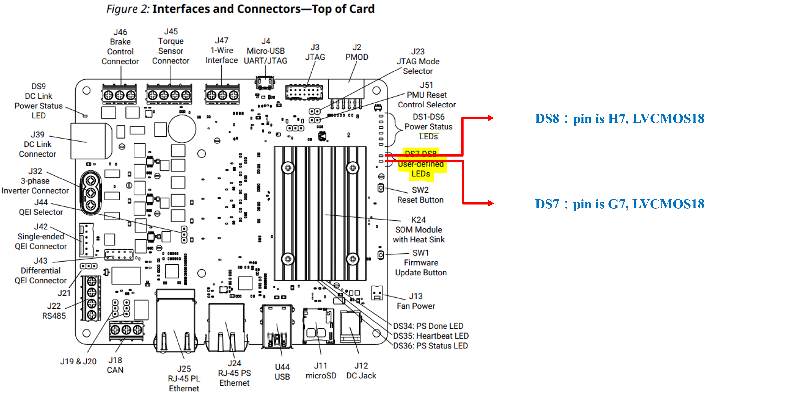

## Generate Bitstream - Generate the programming file and export hardware information to Vitis
1. Generate Bitstream, processing time varies depending on computer performance


2. Export Hardware, which generates a .xsa file for Vitis Import


3. Modify the XSA content for custom IP by opening the Makefile through winrar
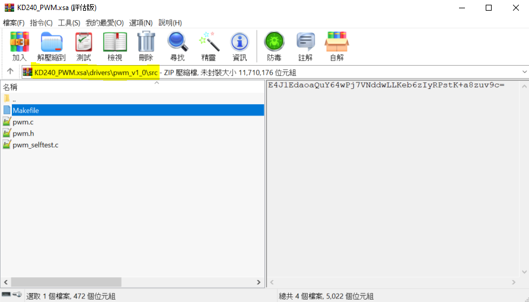

4. Modify the following content and save
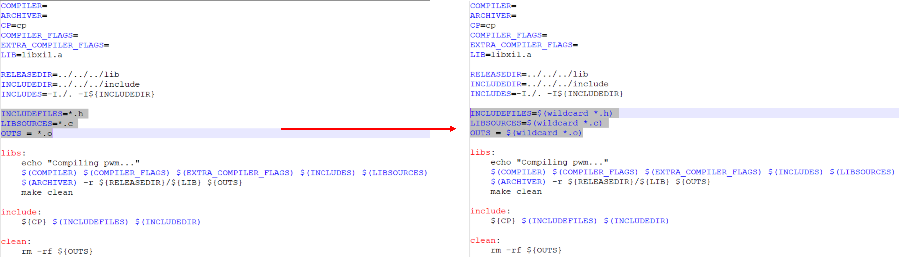

## Vitis
## Create Platform and Application 
1. Create Platform 

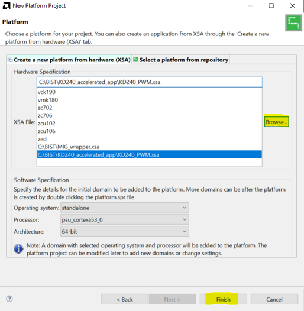

2. After creating, build first to have Library linkage files


3. Create Application 


4. Select the newly created Platform


5. Proceed with Next until selecting Hello World as the program template


6. Modify KD240 BSP - because the default Kria Uart is set to 1, but in Vitis it is set to 0
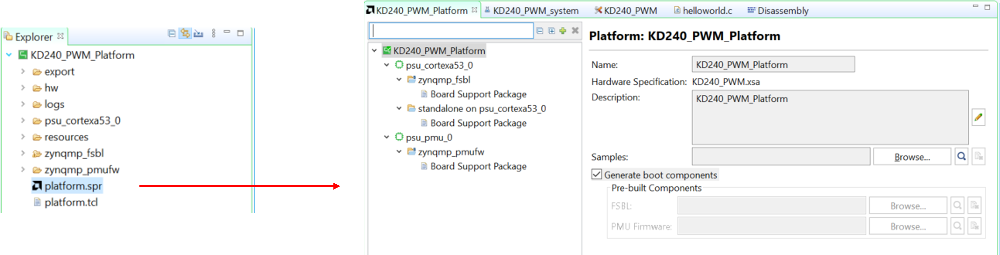


+ The other two files also need to be changed to the above format


7. Remember to rebuild after modifying
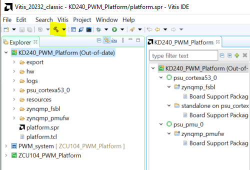

8. Open helloworld.c and modify the program content as follows


## Modify KD240 Boot Behavior
+ Because the Kria series defaults to booting from QSPI, followed by SD card, direct burning may have Register jamming issues, which can be resolved in two ways
+ Modify KD240 boot mode
1. Modify the boot mode through TCL
[Setting Bootmodes — Kria™ SOM 2022.1 documentation (xilinx.github.io)](https://xilinx.github.io/kria-apps-docs/creating_applications/2022.1/build/html/docs/bootmodes.html)
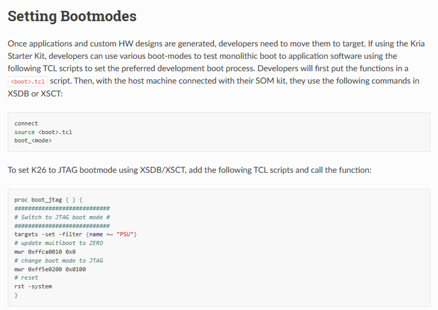

2. After creating the TCL file, enter the following in the xsct of Vitis
```
connect
source ./bootmode.tcl ---> cd to the location where you put the TCL file
boot_jtag
```


+ Modify Run Configuration
1.


2. Uncheck Use FSBL flow for initialization


## Program and Run Demo
The program is successful


## PYNQ
+ This section explains how to control IP written in RTL code in Vivado using Python
+ Functions to control IP in Python need to refer to Vitis
+ Adding flashing LEDs on the PL Ethernet port requires pulling GPIO LEDs again from Vivado


1. Burn the official Ubuntu Image to the KD240, following the steps in the KD240 BIST section
+ Download Ubuntu 22.04 and put it in SDcard through balenaetcher
+ Boot Ubuntu 22.04 from KD240
+ sudo add-apt-repository ppa:xilinx-apps (Optional)
+ Update Ubuntu package
```
sudo apt update
sudo apt upgrade
```
+ Install Xilinx system management snap package ---> sudo snap install xlnx-config --classic (Optional)
+ Install Kria-PYNQ
```
git clone https://github.com/Xilinx/Kria-PYNQ.git
cd Kria-PYNQ
sudo bash install.sh -b KD240
```

2. After successful installation, open a browser on the same network and enter the provided URL to access Jupyter Lab
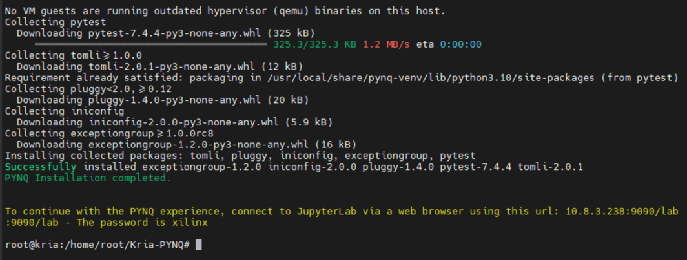

3. Create a folder named PWM_LED


4. Navigate into the PWM_LED folder and place the generated .bit and .hwh files from Vivado. Then create a new Python file

+ The .hwh file is located in the Vivado .gen\sources_1\bd\design_1\hw_handoff directory


5. Start writing Python code in the Python file. The following describes the coding process and API usage. First, import the required Python and PYNQ library packages

```
from pynq import Overlay     ---> The overlay is used for loading bitstream
from pynq.lib import AxiGPIO ---> AxiGPIO is used for reading and writing registers in IP blocks with GPIO
import time                  ---> Time is used for delay time control
from pynq import MMIO        ---> MMIO is used for reading and writing registers in PL by PS. In this case, it's used to control the PL PWM IP
import multiprocessing as mp ---> Multiprocessing allows executing multiple loops simultaneously
```

+ Load the bitstream using Overlay. Note that both the .bit and .hwh files are required


+ Use help(overlay) to view the IP used in the current .bit file, its architecture, and how it corresponds to the design in Vivado
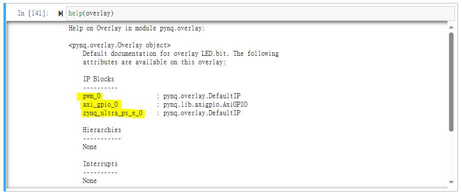

+ Initialize the IP
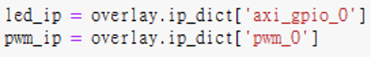

+ Because there are two sets of LEDs on the KD240 PL Ethernet, an additional channel must be set (this step is also required when there is only one set of LEDs)
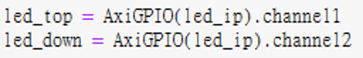

+ Set the GPIO direction, i.e., mask. 0x0 is input, 0xf is output. Also, set the delay value for LED blinking (in seconds)


+ Write the function for LED lighting on the Ethernet port

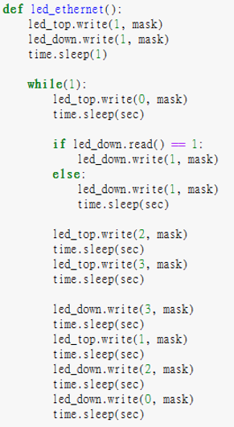

```
LED values for PL Ethernet:
0: Right LED on
1: All LEDs off
2: All LEDs on
3: Left LED on
```

+ Set the memory and register values for the PWM IP


+ These points can refer to Vitis and the Address Editor in Vivado


+ Write the PWM IP function. MMIO reads and writes values to memory locations, similar to the logic in Vitis. You can adapt the Vitis C code to Python code


+ To execute both loops simultaneously, use Multi-Process to add the functions to different processes and run them synchronously
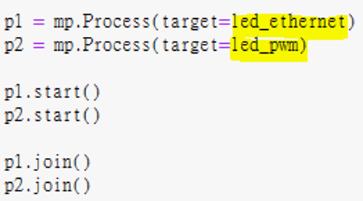

6. Demo result


## Reference
1. [【ZYNQ Ultrascale+ MPSOC FPGA Tutorial】Chapter 30 Custom IP Experiment](https://www.cnblogs.com/alinx/p/14311827.html)
2. [Bootmodes — Kria™ SOM 2022.1 documentation](https://xilinx.github.io/kria-apps-docs/creating_applications/2022.1/build/html/docs/bootmodes.html)
3. [Development process and questions about KR260 standalone](https://support.xilinx.com/s/question/0D54U00005VTYUvSAP/development-process-and-questions-about-kr260-standalone?language=en_US)
4. [ug1093-kd240-starter-kit.pdf](https://docs.xilinx.com/viewer/book-attachment/Pkj1VOY1YOjY5KknJN14Tw/IxMAXzlNJgDQGeaYQ2ffUw)
5. [Loading an Overlay — Python productivity for Zynq (Pynq) v1.0](https://pynq.readthedocs.io/en/v2.3/pynq_overlays/loading_an_overlay.html)
6. [pynq.lib.axigpio Module — Python productivity for Zynq (Pynq) v1.0](https://pynq.readthedocs.io/en/v2.3/pynq_package/pynq.lib/pynq.lib.axigpio.html#pynq-lib-axigpio)
7. [Using Custom IP with the PYNQ Framework: PYNQ IP](https://blog.csdn.net/quhai1340/article/details/113971309)


